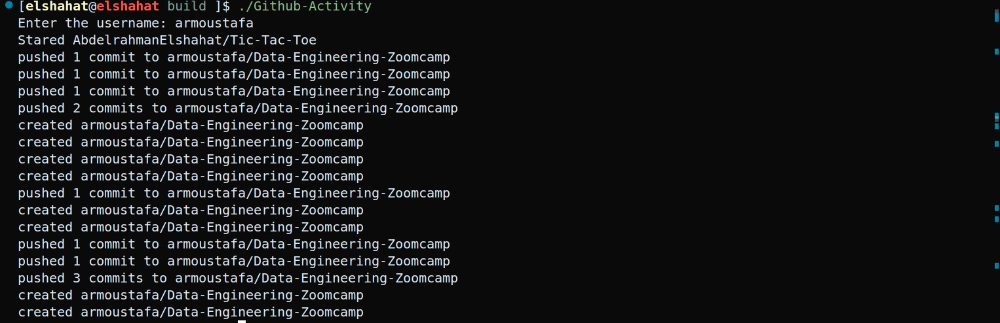
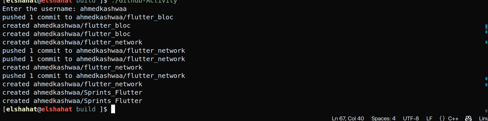

# GitHub-User-Activity

[](https://isocpp.org/)
This project is a c++ cli application that displays the activity of a GitHub user. It uses the GitHub API to fetch the user's activity and displays it in a list.





## Table of Contents

- [Overview](#overview)
- [Features](#features)
- [Installation](#installation)
- [Usage](#usage)
- [Contributing](#contributing)

## Overview

GitHub User Activity is a simple application that allows users to view the activity of a GitHub user. Users can enter the username of a GitHub user and view their recent activity .

## Features

you can view the following activities of a GitHub user:

- **pushed:** Commits pushed to a repository.

- **created:** Repositories, branches, or tags created.
- **pulled:** Pull requests merged.
- **forked:** Repositories forked.
- **starred:** Repositories starred.

## Installation

### Prerequisites

- A C++ compiler that supports C++11 or later.
- [CMake](https://cmake.org/) installed on your system.

### Build Instructions

1. **Clone the Repository**

   ```bash
   git clone https://github.com/AbdelrahmanElshahat/Github-Activity.git
   cd Github-Activity
2. **Build the Project**

   ```bash
   mkdir build
   cd build
   cmake ..
   cmake --build .

## Usage

After building the project, you can run the application from the terminal. The application supports the following commands:

 **Enter Username:** Enter the username of the GitHub user you want to view.

## Contributing

Contributions are welcome! To contribute:

1. Fork the repository.

2. .Create a new branch.

    ```bash

    git checkout -b feature/your-feature-name.

3. Make your changes and commit them.

    ```bash
    git commit -m 'Add some feature'.

4. Push to your branch.

    ```bash
    git push origin feature/your-feature-name
